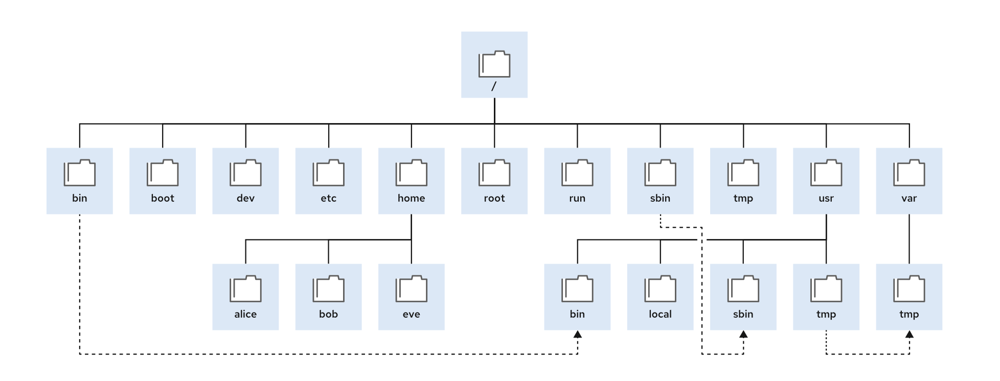

## File System Directories in RHEL9


| Location | Purpose |
| -------- | ---------------------- |
| **/boot** | Files required to start the boot process. |
| **/dev** | Special device files used to access hardware. |
| **/etc** | System-specific configuration files. |
| **/home** | User home directories for storing personal data and configurations. |
| **/root** | Home directory for the administrative superuser (root). |
| **/run** | Runtime data for processes started since the last boot (e.g., PID files, lock files). Recreated on reboot. Consolidates `/var/run` and `/var/lock` from earlier RHEL versions. |
| **/tmp** | Temporary files. Files not accessed or modified in 10 days are deleted automatically. The `/var/tmp` directory is another temporary space, with files deleted after 30 days. |
| **/usr** | Installed software, shared libraries, and read-only program data. Key subdirectories include:
  - **/usr/bin**: User commands
  - **/usr/sbin**: System administration commands
  - **/usr/local**: Locally customized software |
| **/var** | System-specific variable data (e.g., databases, cache directories, logs, spooled documents). Data persists between reboots. |

---

## Specifying File Paths

### Absolute Path
- Begins at the root (`/`).

### Relative Path
- `.`: Current directory
- `..`: Parent directory

### Navigation Commands
```bash
pwd          # Print working directory
ls           # List contents of a directory
ls -l        # Detailed list with permissions
ls -a        # Include hidden files
ls -la       # Combined detailed and hidden files view
cd           # Change directory
cd ~         # Go to the home directory
cd ..        # Go to the parent directory
touch        # Create an empty file
```

---

## Managing Files and Directories

| Command  | Description |
| -------- | ----------- |
| **mkdir** | Create directories. |
| **mkdir -p** | Create missing parent directories. |
| **cp** | Copy files. |
| **cp -r** | Copy directories and their contents. |
| **mv** | Move files and directories. |
| **rm** | Remove files. |
| **rm -r** | Remove directories and their contents. |
| **rm -ri** | Prompt user confirmation before removal (interactive mode). |

---

## Creating Links Between Files

### Hard Links
```bash
ln {existing_file} {new_file}
```
- Hard links reference the same data store location as the original file.
- Check link count using `ls -l`.
- Remains functional even if the original file is deleted.

#### Limitations
- Can only link regular files (not directories or special files).
- Both files must be in the same file system (use `df` to check the file system).

### Soft Links (Symbolic Links)
```bash
ln -s {existing_file_or_directory} {link_name}
```
- Can link any file or directory.
- Independent of the file system.
- Points to the file name rather than the data; becomes invalid if the original file is deleted and not recreated.

---

## Matching File Names with Shell Expansions

### Pattern Matching and Meta Characters
| Pattern       | Matches |
| ------------- | ------- |
| `*`           | Any string of zero or more characters. |
| `?`           | Any single character. |
| `[abc...]`    | Any character listed inside the brackets. |
| `[!abc...]`   | Any character not listed inside the brackets. |
| `[^abc]`      | Any character not listed inside the brackets. |
| `[[:alpha:]]` | Any alphabetic character. |
| `[[:lower:]]` | Any lowercase character. |
| `[[:upper:]]` | Any uppercase character. |
| `[[:alnum:]]` | Any alphanumeric character. |
| `[[:punct:]]` | Any printable character not a space or alphanumeric. |
| `[[:digit:]]` | Any digit (0-9). |
| `[[:space:]]` | Any whitespace (tabs, newlines, spaces). |

### Brace Expansion
- Expands sequences of strings.
  ```bash
  echo {m..p}  # Output: m n o p
  ```

### Tilde Expansion
- Use `~` to represent the current user's home directory.

### Variable Expansion
```bash
VARIABLENAME=value
echo $VARIABLENAME
echo ${VARIABLENAME}
```

### Command Substitution
- Replaces a command with its output.
```bash
$(command)
```

### Protecting Arguments from Expansion
- Use `\` to escape a single character.
- Use `''` to prevent all expansions.
- Use `""` to prevent all expansions except `$`, `\`, backtick , `!` .
