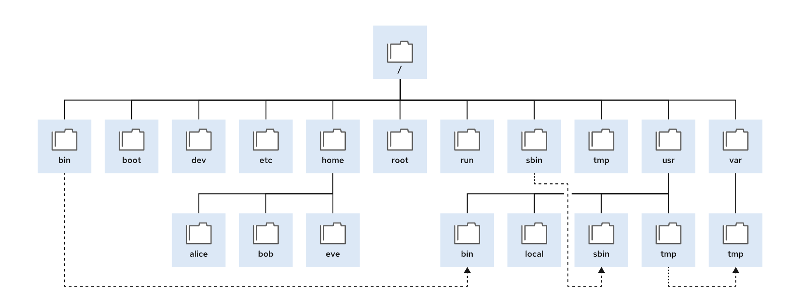

| Location | Purpose                                                                                                                                                                                                                                                                                                                                         |
| -------- | ----------------------------------------------------------------------------------------------------------------------------------------------------------------------------------------------------------------------------------------------------------------------------------------------------------------------------------------------- |
| /boot    | Files to start the boot process.                                                                                                                                                                                                                                                                                                                |
| /dev     | Special device files that the system uses to access hardware.                                                                                                                                                                                                                                                                                   |
| /etc     | System-specific configuration files                                                                                                                                                                                                                                                                                                             |
| /home    | Home directory, where regular users store their data and configuration files.                                                                                                                                                                                                                                                                   |
| /root    | Home directory for the administrative superuser, root.                                                                                                                                                                                                                                                                                          |
| /run     | Runtime data for processes that started since the last boot. This data includes  process ID files and lock files. The contents of this directory are re-created on  reboot. This directory consolidates the /var/run and /var/lock directories  from earlier versions of Red Hat Enterprise Linux.                            |
| /tmp     | A world-writable space for temporary files. Files that are not accessed, changed,  or modified for 10 days are deleted from this directory automatically. The /var/  tmp directory is also a temporary directory, in which files that are not accessed,  changed, or modified in more than 30 days are deleted automatically. |
| /usr     | Installed software, shared libraries, including files, and read-only program data.  Significant subdirectories in the /usr directory include the following commands:                                                                                                                                                                      |
|          | /usr/bin: User commands                                                                                                                                                                                                                                                                                                                         |
|          | /usr/sbin: System administration commands                                                                                                                                                                                                                                                                                                       |
|          | /usr/local: Locally customized software                                                                                                                                                                                                                                                                                                         |
| /var     | System-specific variable data should persist between boots. Files that  dynamically change, such as databases, cache directories, log files, printer-  spooled documents, and website content, might be found under /var.                                                                                                           |
|          |                                                                                                                                                                                                                                                                                                                                                 |                                                                                                        |